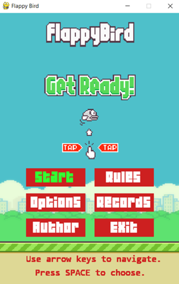

# Game Title
## Author: Julia Grzegorzewska

### Short description
I am a student at Wrocław University of Science and Technology and this is my programming project in Python.
Flappy Bird is a popular arcade game in which player is moving the bird by tapping a space button and try to avoid pipes to get points.

### Technologies
**Python** - Programming language of whole project
**Pygame** - Python's library for making games

### How to run this app?
1. Clone the template project: 
`git clone  https://github.com/grzesiaaa/Game-Template.git FlappyBird`
`cd FlappyBird `
2. Install the project's development and runtime requirements:
`pip install -r requirements.txt`
3. Run the game:
`python FlappyBird.py`

### Screenshots
Several screenshots showing the appearance of the game and encouraging you to play :blush:

